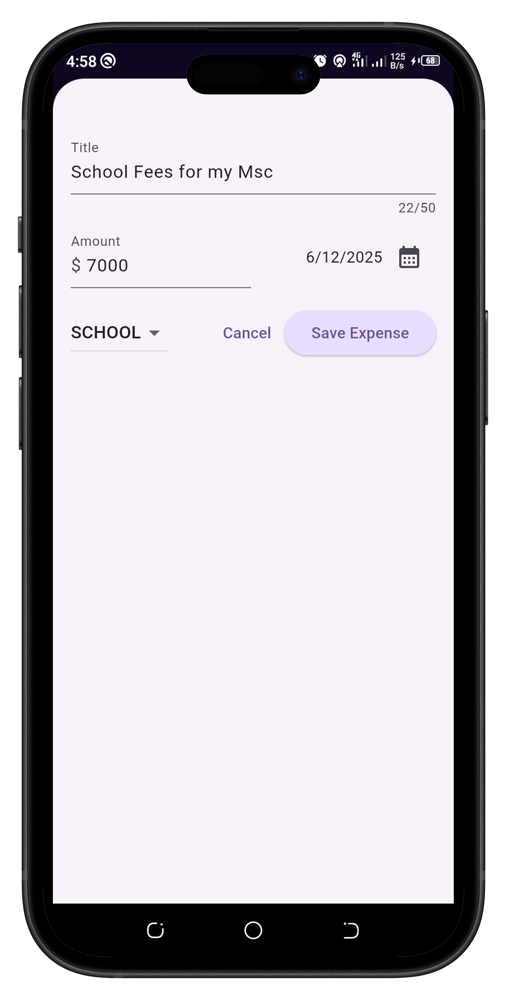

# Expense Tracker

  

## Overview

ExpenseTracker is built to help users keep track of their daily expenses. It gives you control over your spendings, and makes you to always be aware of the extent of your expenses.

The application has a chart section that gives a visual representation of the percentages of the various expenses.

## Dependencies / Plugins

- **Uuid** - In this project, we used the uuid package to automatically generate a unique id for every expense created.
- **Intl** - This package provides localization and internationalization. This includes message formatting and replacement, date and number formatting and parsing and tools for working with Bidirectional text.

## How to Install and Test the Application

You can clone this project on your local machine. To do that, you must have git installed on your local machine.
**Flutter and Dart** must be installed. Click [here](https://flutter.dev) to download.

1. Open your terminal and navigate to your desired directory
2. Run this command `git clone https://github.com/kenbuzor/expense_tracker.git` this will create a directory called expense_tracker which houses all the files and folders of the project, it is the project root.
3. Navigate to the cloned project `cd expense_tracker/`
4. Open the project on vscode with this command `code .` Note, you can use any code editor of your choice.
5. On your terminal, in the root of your project, run this command to install all necessary dependencies if any `flutter pub get`
   **Note:** _You must have flutter and dart installed on your local machine_
6. You can now read and modify code to suit your need and test the app on an emulator/simulator or on a real device.

## Conclusion

Start to track of your expenses today with ExpenseTracker to keep you far away from the corridors of financial bankruptcy.

Happy spending with frugality.
